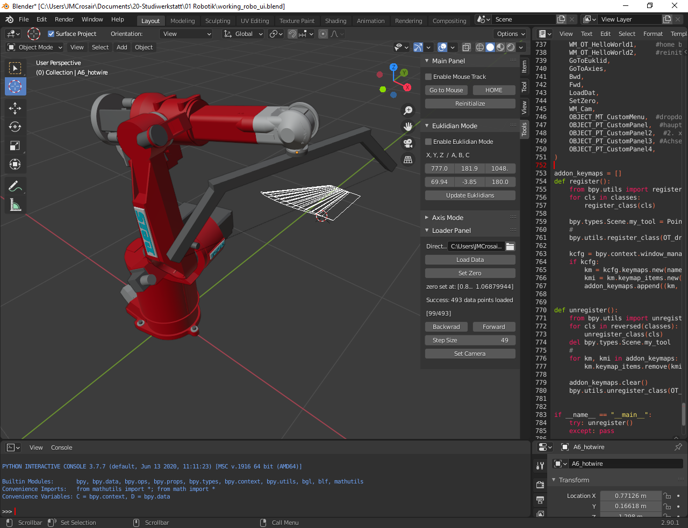
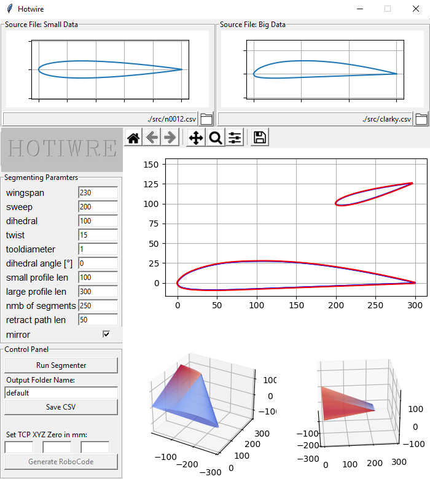

<pre>
  _    _  ____ _________          _______ _____  ______ 
 | |  | |/ __ \__   __\ \        / /_   _|  __ \|  ____|
 | |__| | |  | | | |   \ \  /\  / /  | | | |__) | |__   
 |  __  | |  | | | |    \ \/  \/ /   | | |  _  /|  __|  
 | |  | | |__| | | |     \  /\  /   _| |_| | \ \| |____ 
 |_|  |_|\____/  |_|      \/  \/   |_____|_|  \_\______|
</pre>                                                        

Hotwire is a CAM-Tool used for tool path generation for 6-axis industrial robots. The intended use is foam cutting tapered wing profiles using a hot wire cutter. Hotwire_GUI.py is used for generating tool paths which can then be previewed using the Hotwire_Blender_GUI. For installation and usage of Hotwire_Blender_GUI go to ./Hotwire_Blender_GUI/HWBG_README.md. This readme is for Hotwire_GUI.py only.

<table border="0"><td width="58.5%">
  </td><td>
  </td></table>

## Installation

Tested using Python 3.8.5\
Requires following modules:\
-NumPy\
-ScyPy\
-TKinter\
-Matplotlib\
-PIL (pillow)

## Required input

Hotwire requires two CSV files as input which can be downloaded and generated at http://www.airfoiltools.com/ . The profile length must be set using airfoiltools. The input files must not have a pre-determined angle of attack! (Segmentation algorithm will likely fail to connect properly if one or both files have pre-determined aoas.)

## What the program outputs

Hotwire outputs two files (or 4 if mirror is checked):

-1- A CSV file containing the toolpath information.
The toolpath is structured as follows:

(n = amnt of segments)\
n-lines of TCP movement: TCPX; TCPY; TCPZ; RotnX; RotnY; RotnZ\
followed by n-lines of segment 1/2 pairs: Sgmnt1X; Sgmnt1Y; Sgmnt1Z; Sgmnt2X; Sgmnt2Y; Sgmnt2Z;

The latter n-lines are only used for visualization purposes in Blender-GUI and not needed for the actual robot code generation.
 
-2- A CSV file containing the robot code (robot language RSV).\
Robot code position syntax: Base X,Y,Z,A,B,C,A1,A2,A3,A4,A5,A6

## Usage

-1- Click the folder icons and set both paths\
-2- Choose your Segmenting Parameters. Make sure the small/large profile len is set properly according to the actual profile length of the input file\
-3- Click "Run Segmenter". Check the 2D plot for errors. The blue line indicates the interpolated contour. The red line indicates the calculated toolpath. Also check the 3D plot(s)\
-4- Choose a name for your output folder\
-5- Click Save CSV. The toolpath is now saved and can be viewed with Blender-GUI\
-6- Find the physical TCP zero point (using the IRL robot) and set it using the "Set TCP XYZ Zero in mm" input field.\
-7- Click "Generate RoboCode". All files are saved in ./Output_Files/[folder name]\
-8- Transmit the output SRC file to your robot and compile it.\

## How the segmentation algorithm works

Segmentation algorithm: Segments both profiles into an equal number of segments and proceeds to connect each segment-pair by a vector. The resulting vector array is then transformed into a TCP movement. A more detailed explanation can be inquired from the docstring of the hotwire() function in /src/functional_hotwire.py

Segmenting parameters: The segmenting algorithm can be programmed using 11 parameters:

|      Parameter      | Description                                                                                         |
|:-------------------:|:---------------------------------------------------------------------------------------------------:|
| Wingspan            | Distance[mm] between the two profiles                                                               |
| Sweep               | Distance[mm] leading-edge to leading-edge                                                           |
| Dihedral            | Height[mm] sprofile relative to lprofile                                                            |
| Twist               | Twist angle (angle between both chords)                                                             |
| Tooldiameter        | Wire + melting thickness (toolpath will be offset radially to account for material melt away)       |
| Dihedral Angle      | Performs x-axis rotation on toolpath (doesn't actually affect dihedral, must be set by "Dihedral")  |
| Small profile len   | Length of input profile                                                                             |
| Large profile len   | Length of input profile                                                                             |
| Nmb of segments     | Number of segments created by segmenter                                                             |
| Retract path len    | Adds retraction path to trailing edge to avoid having the hot wire resting in material              |
| Mirror              | Mirrors profile and toolpath (will generate 4 files instead of 2)                                   |
